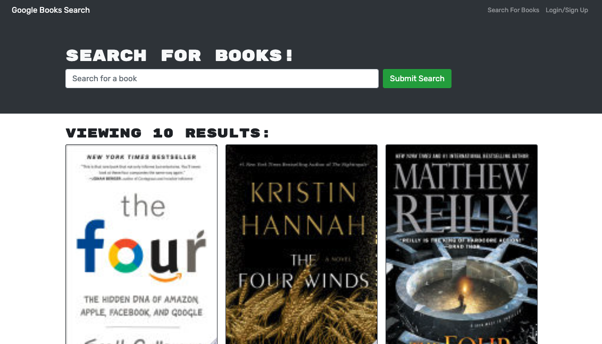

# Book Search Engine
Most modern websites are driven by two things: data and user demands.  The ability to personalize user data is the cornerstone of real-world web development, and as user demands evolve applications need to be more performant. Book Search engine is a web application that leverages Google Books API to search for book information and maintain a personalized list of saved books associated with a user account. A user's Saved Books List can be augmented at any time by adding or removing books. 

Originally a RESTful API, this project focused on refactoring the application to a GraphQL API built with Apollo Server. The app uses the MERN stack with a React front end, MongoDB database, and Node.js/Express.js server and API. 

## Summary
[Click here to use the Book Search Engine.](https://book-search-engine-211115.herokuapp.com/)

* Core functionality is a simple Search (for Books) with an input field to search for books that fetches data from the Google Books API.
* Unauthenticated users:
  * The menu options are: Search for Books and Login/Signup
  * Using search renders several search results, each featuring a book’s title, author, description, image, a link to that book on the Google Books site,
* Authenticated users:
  * The menu options are: Search for Books, see your Saved Books, and Logout
  * Using search renders several search results, each featuring a book’s title, author, description, image, a link to that book on the Google Books site, and a button to save a book to my account
* Users can Save any book returned in search results. It is added to the Saved Books List associated with their account.
* A user's Saved Books List includes all of the books saved to their account. 
  * Each book renders: title, author, description, image, a link to that book on the Google Books site, and a button to remove a book from their Saved Books List
* Users can use the Remove button on any saved book to delete it from their Saved Books List.
* When the user logs out, they are presented with a menu with the options Search for Books and Login/Signup and an input field to search for books and a submit button.
* The Login/Signup menu option opens a modal with a toggle between the option to log in or sign up
  * Signup includes inputs for a username, an email address, and a password. Upon submission of valid email and password, the new user's account is created and they are logged in.
  * Login includes inputs for an email address and a password.

## Installation
Ensure you have Node.js installed locally to install packages to and from the public npm registry. Node.js installation documentation.

1. Clone the repository to your local machine.

2. Install application dependencies `npm install`.
Required when when you first set up the project for local development or use OR if any changes are made to the project's dependencies. More Node information here.

3. Start the application with `npm start`. This will open the app in a new tab in your default web browser. 

## Technologies
* [Mongo DB](https://www.mongodb.com/) - The NoSQL database used to support record storage.
* [React](https://reactjs.org/) - Javascript library used to generate all user interfaces.
* [Node](https://nodejs.org/en/) - Asynchronous event-driven JavaScript runtime environment that executes JavaScript code outside a web browser.
* [NPM](https://www.npmjs.com/) - Node package manager, used in conjunction with JS and Inquirer to support application logic and Command Line interface.
  * [GraphQL](https://www.npmjs.com/package/graphql) - JavaScript reference implementation for GraphQL, a query language for APIs.
  * [@Apollo-client](https://www.npmjs.com/package/@apollo/client) - Enables UI components that fetch data via GraphQL.
  * [Apollo-server-express](https://www.npmjs.com/package/apollo-server-express) - Express integration of Apollo Server, an open-source GraphQL server that works with many Node.js HTTP server frameworks.
  * [Mongoose](https://www.npmjs.com/package/mongoose) - Mongoose is a MongoDB object modeling tool used for all models in this application.
  * [Expressjs](https://expressjs.com/) - Leveraged for API's, utility methods, and middleware.
  * [jsonwebtoken](https://www.npmjs.com/package/jsonwebtoken)
  * [Bcrypt](https://www.npmjs.com/package/bcrypt) - Used for password hashing.
  * [React-Bootstrap](https://react-bootstrap.github.io/getting-started/introduction/) - Bootstrap CSS framework for React projects.
* [Javascript](https://developer.mozilla.org/en-US/docs/Web/javascript) - Core app logic.
* [CSS](https://devdocs.io/css/) - Used to style html elements on the page as needed beyond Bootstrap.
* [HTML](https://developer.mozilla.org/en-US/docs/Web/HTML) - Used to create elements on the DOM.
* [Git](https://git-scm.com/doc) - Version control system to track changes to source code.
* [GitHub](https://docs.github.com/en) - Hosts the code repository.

* [Google Books API](https://developers.google.com/books/) - Data for search engine

## Author
Sarah Hollingsworth
* [Github](https://github.com/sahhollingsworth)
* [LinkedIn](https://www.linkedin.com/in/sarahhollingsworth/)

## References
* [GraphQL `input` typeDef Documentation](https://graphql.org/graphql-js/mutations-and-input-types/)

## License
* Licensed under the [MIT](https://opensource.org/licenses/MIT) license.